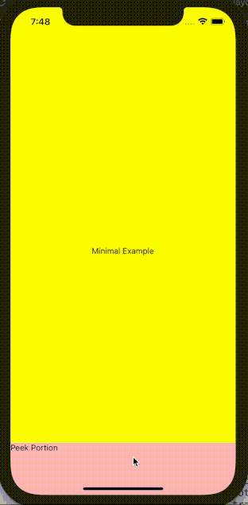
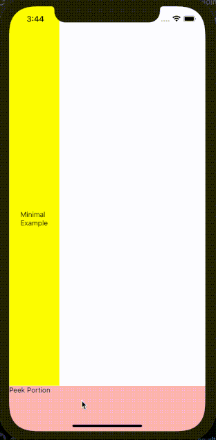

# react-native-sliding-drawer

A React Native component that creates a sliding drawer on any side of the screen

## Installation

```sh
npm install react-native-sliding-drawer
```

## Usage

```js
<SlidingDrawer peekSize={90} openSize={270} fixedLoc="bottom">
  <DrawerContent />
</SlidingDrawer>
```

A minimal workable example is shown below.

```js
import * as React from 'react';
import {View, Text} from 'react-native';
import {SlidingDrawer} from 'react-native-sliding-drawer';

const App = () => {
  const peekSize = 90;
  const openSize = 270;
  return (
    <View
      style={{
        flex: 1,
        justifyContent: 'center',
        alignItems: 'center',
        backgroundColor: 'yellow',
      }}>
      <Text>Minimal Example</Text>
      <SlidingDrawer peekSize={peekSize} openSize={openSize} fixedLoc="bottom">
        <View style={{flex: 1, backgroundColor: 'red'}}>
          <View style={{height: peekSize, backgroundColor: 'pink'}}>
            <Text>Peek Portion</Text>
          </View>
          <View>
            <Text>Open Portion</Text>
          </View>
        </View>
      </SlidingDrawer>
    </View>
  );
};

export default App;
```




## Comprehensive Examples

* [Peekable](./docs/demos/peekable.md)

* [NonSlideOpen](./docs/demos/nonSlideOpen.md)

* [FadePeekableNotTappable](./docs/demos/fadeBgPeekableNotTappable.md)

* [FadeBgNonSlideOpenNotTappable](./docs/demos/fadeBgNonSlideOpenNotTappable.md)

* [FadeBgTappable](./docs/demos/fadeBgTappable.md)


## Run Examples

Go to the `example` folder and sets up the example app

```sh
npm install
```

Then go to the root folder to run the example app for iOS

```sh
yarn example ios
```

or Android

```sh
yarn example android
```

Comment and uncomment appropriate source code in [`App.tsx`](./example/App.tsx) to run either the minimal example or the comprehensive examples.

## Props

| Props                      | Type                                     | Default    | Note                                                                                                                                                                                           |
|----------------------------|------------------------------------------|------------|------------------------------------------------------------------------------------------------------------------------------------------------------------------------------------------------|
| `peekSize`                 | `number`                                 | (required) | The height of the visible section of the drawer after it is closed. This is also referred to as the peek section. If set to 0, the drawer completely disappears after it is closed.            |
| `openSize`                 | `number`                                 | (required) | The height of the entire visible drawer's after it is opened. Note that this is **NOT** the height of the drawer's open section, but the sum of the heights of the peek and open sections.         |
| `fixedLoc`                 | `'top' \| 'bottom' \| 'left' \| 'right'` | (required) | The location where the sliding drawer is located. Can only be one of the four allowed strings.                                                                                                 |
| `drawerWidth`              | `number`                                 | `-1`       | Manual override of the drawer's width. Applicable only when `fixedLoc` is `top` or `bottom`. Default to -1, meaning no manual override is present.                                             |
| `drawerHeight`             | `number`                                 | `-1`       | Manual override of the drawer's height. Applicable only when `fixedLoc` is `left` or `right`. Default to -1, meaning no manual override is present.                                            |
| `maxPct`                   | `number`                                 | `0.5`      | Maximum percentage of the height (when `fixedLoc` is `top` or `bottom`) or width (when `fixedLoc` is `left` or `right`) of a screen that a drawer cannot slide pass. Default to 0.5.           |
| `sensitivity`              | `number`                                 | `10`       | The amount of pixels a drawer needs to slide to trigger state change (peek to open or open to peek). The smaller the value, the more sensitive the state change. Default to 10.                |
| `expandable`               | `boolean`                                | `true`     | A flag indicating whether a drawer is static (non-expandable) or dynamic (expandable). Default to true, i.e. the drawer is dynamic.                                                            |
| `isInitialPeek`            | `boolean`                                | `true`     | A flag indicating whether the initial state of the drawer is peek or open. Default to true, i.e. the initial state is peek.                                                                    |
| `enableSlideOpen`       | `boolean`                                | `true`    | A flag indicating whether a drawer can be opened with sliding (e.g. open upon a button press). Default to true.                                                                            |
| `enableNonSlideOpen`       | `boolean`                                | `false`    | A flag indicating whether a drawer can be opened without sliding (e.g. open upon a button press). Default to false.                                                                            |
| `nonSlideOpen`             | `boolean`                                | `false`    | A flag indicating whether to open or close a drawer. Applicable only when `enableNonSlideOpen` is set to true. Default to false, i.e. to close the drawer.                                     |
| `onDrawerOpen`             | `() => void`                             | `() => {}` | A callback function when the drawer reaches the open state. See the caveat section for the particularity of its usage. Default to a no-operation function.                                     |
| `onDrawerPeek`             | `() => void`                             | `() => {}` | A callback function when the drawer reaches the peek state. See the caveat section for the particularity of its usage. Default to a no-operation function.                                     |
| `speed`                    | `number`                                 | `20`       | The speed config in React Native's `Animation.spring` method. Default to 20. The larger it is, the faster the drawer opens and closes.                                                         |
| `useNativeDriver`          | `boolean`                                | `false`    | A flag indicating whether to use native driver for animation. Default to false.                                                                                                                |
| `enableFadeBackground`     | `boolean`                                | `false`    | A flag indicating whether a fade in background is visible upon drawer movement. Specifically, as the drawer opens, the background darkens; as the drawer closes, the background brightens.     |
| `maxFadeBackgroundOpacity` | `number`                                 | `0.5`      | Max opacity the background reaches when the drawer is in the open state. Applicable only when `enableFadeBackground` is set to true. Default to 0.5.                                           |
| `onFadeBackgroundPress`    | `() => void`                             | `() => {}` | A callback function when the fade background is pressed after the drawer is in the open state. Applicable only when `enableFadeBackground` is set to true. Default to a no-operation function. |

## Caveats

Some caveats and gotchas while using `react-native-sliding-drawer`

### 1. `<SlidingDrawer></SlidingDrawer>` must NOT have restricting parent

`<SlidingDrawer></SlidingDrawer>` is sensitive to position. Its own position prop is set to "absolute", but if some of its parent components have restricting positioning or sizing, the rendered sliding drawer might have unexpected height, width, peek size, etc. It is thus highly recommended that `<SlidingDrawer></SlidingDrawer>` has as few parents as possible (i.e. it is coded as close to top level component as possible). This way, there is less risk of the sliding drawer being constraint by some other components. If, however, the sliding drawer must be deeply nested, make sure that each of its parent has loose positioning or sizing.

For instance, the minimal workable example is a valid way use `<SlidingDrawer></SlidingDrawer>`, because its parent spreads the entire screen. However, if we put a restricting style on the parent such as the one shown below

```js
import * as React from 'react';
import {View, Text} from 'react-native';
import {SlidingDrawer} from 'react-native-sliding-drawer';

const App = () => {
  const peekSize = 90;
  const openSize = 270;
  return (
    <View
      style={{
        flex: 1,
        justifyContent: 'center',
        alignItems: 'center',
        backgroundColor: 'yellow',
        width: 100,
      }}>
      <Text>Minimal Example</Text>
      <SlidingDrawer peekSize={peekSize} openSize={openSize} fixedLoc="bottom">
        <View style={{flex: 1, backgroundColor: 'red'}}>
          <View style={{height: peekSize, backgroundColor: 'pink'}}>
            <Text>Peek Portion</Text>
          </View>
          <View>
            <Text>Open Portion</Text>
          </View>
        </View>
      </SlidingDrawer>
    </View>
  );
};

export default App;
```

The sliding drawer no longer behaves as expected


Note that the only difference between the erroneous example above and the minimal workable example is the addition of style `width: 100` to the parent component.

To resolve this issue, we can remove the restricting style. Yet, if the restricting style has to stay, another way to resolve the problem is to take `<SlidingDrawer></SlidingDrawer>` out of its restricting parent like this

```js
const App = () => {
  const peekSize = 90;
  const openSize = 270;
  return (
    <>
      <View
        style={{
          flex: 1,
          justifyContent: 'center',
          alignItems: 'center',
          backgroundColor: 'yellow',
          width: 100,
        }}>
        <Text>Minimal Example</Text>
      </View>
      <SlidingDrawer peekSize={peekSize} openSize={openSize} fixedLoc="bottom">
        <View style={{flex: 1, backgroundColor: 'red'}}>
          <View style={{height: peekSize, backgroundColor: 'pink'}}>
            <Text>Peek Portion</Text>
          </View>
          <View>
            <Text>Open Portion</Text>
          </View>
        </View>
      </SlidingDrawer>
    </>
  );
};
```

Now the sliding drawer behavior is normal



At the end of the day, trial-and-error is our best friend to determine what parent is suitable for the sliding drawer.


### 2. `onDrawerOpen` and `onDrawerPeek` CANNOT handle dynamic variable when the drawer is opened or closed by sliding

A good example of this behavior is demonstrated below.

```js
import * as React from 'react';
import {View, Text, TouchableOpacity} from 'react-native';
import {SlidingDrawer} from 'react-native-sliding-drawer';

const App = () => {
  const peekSize = 90;
  const openSize = 270;
  const [count, setCount] = React.useState(0);
  const [isInitialPeek, setIsInitialPeek] = React.useState(true);
  const [nonSlideOpen, setNonSlideOpen] = React.useState(false);

  return (
    <View
      style={{
        flex: 1,
        justifyContent: 'center',
        alignItems: 'center',
        backgroundColor: 'yellow',
      }}>
      <Text style={{fontSize: 50}}>{count}</Text>
      <TouchableOpacity
        style={{
          margin: 20,
          padding: 5,
          borderWidth: 2,
          borderColor: isInitialPeek ? 'green' : 'red',
          borderRadius: 10,
        }}
        onPress={() => setNonSlideOpen(!nonSlideOpen)}>
        <Text style={{fontSize: 20, color: isInitialPeek ? 'green' : 'red'}}>
          {isInitialPeek ? 'Open' : 'Close'}
        </Text>
      </TouchableOpacity>
      <SlidingDrawer
        peekSize={peekSize}
        openSize={openSize}
        fixedLoc="bottom"
        isInitialPeek={isInitialPeek}
        enableNonSlideOpen={true}
        nonSlideOpen={nonSlideOpen}
        onDrawerOpen={() => {
          setIsInitialPeek(false);
          setNonSlideOpen(true);
          setCount(count + 1);
        }}
        onDrawerPeek={() => {
          setIsInitialPeek(true);
          setNonSlideOpen(false);
          setCount(count + 1);
        }}>
        <View style={{flex: 1, backgroundColor: 'red'}}>
          <View style={{height: peekSize, backgroundColor: 'pink'}}>
            <Text>Peek Portion</Text>
          </View>
          <View>
            <Text>Open Portion</Text>
          </View>
        </View>
      </SlidingDrawer>
    </View>
  );
};

export default App;
```


The desired behavior is that each time the drawer opens or closes, the counter counts up. We can see that the desired behavior is achieved using the non-slide open feature. However, when the drawer slides open or close, the counter gets stuck at 1. This is `onDrawerOpen` and `onDrawerPeek` are cached in a ref (hence, the value in `count` is forever the initialized value, which is 0) when the drawer is opened or closed via sliding. Any further change to `count` does not alter its cached value inside the ref. On the other hand, the two callbacks are NOT cached when the drawer is opened or closed via the non-slide open feature. Hence, the value in `count` does change.

There are two ways to work around this limtation.

1. If the values in the callback can be hard coded, do it! For instance, instead of using `setIsInitialPeek(!isInitialPeek)` for both `onDrawerOpen` and `onDrawerPeek`, hard code the true and false value.
2. If including dynamic variables is inevitable for the two callbacks, consider disabling the slide open feature. This can be achieved by setting the prop `enableSlideOpen` to false.

Of course, if anyone has a solution to directly resolve this issue, please share your thoughts and open a pull request.


## Contributing

See the [contributing guide](CONTRIBUTING.md) to learn how to contribute to the repository and the development workflow.

## License

MIT
