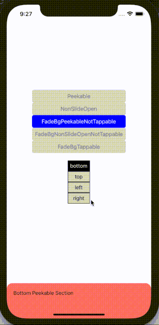
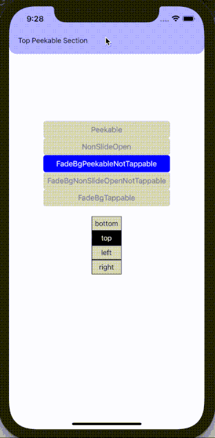

# FadeBgPeekableNotTappable

[Source code](../../example/src/FadeBgPeekableNotTappable)

Same layout as Peekable, except that as the drawer slides open, the background gradually gets darker. However, the dark background is not tappable.

<table>
  <tr>
    <td>  </td>
    <td>  </td>
  </tr>
  <tr>
    <td>  </td>
    <td>  </td>
  </tr>
</table>