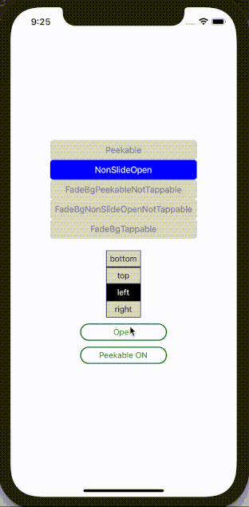

# NonSlideOpen

[Source code](../../example/src/NonSlideOpen)

Upon pressing a button, the drawer opens up. Press the button again, the drawer closes. It works with or without the peekable section.

<table>
  <tr>
    <td>  </td>
    <td>  </td>
  </tr>
  <tr>
    <td>  </td>
    <td>  </td>
  </tr>
</table>
