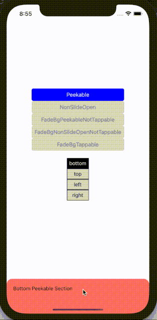
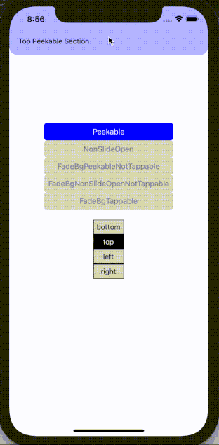
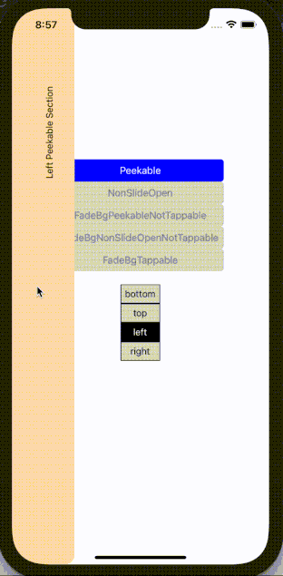
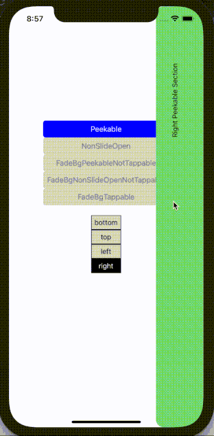

# Peekable

[Source code](../../example/src/Peekable)

The sliding drawer has one section always visible (peekable section). Upon sliding on this section, the drawer opens up and reveals the other section (open section). Slide the opened drawer in the other direction closes the drawer to its peek position.

<table>
  <tr>
    <td>  </td>
    <td>  </td>
  </tr>
  <tr>
    <td>  </td>
    <td>  </td>
  </tr>
</table>