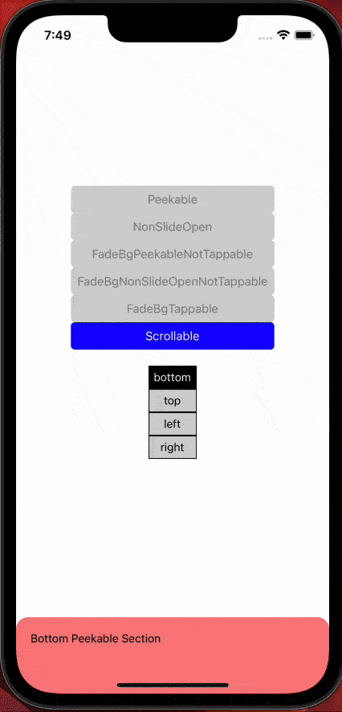
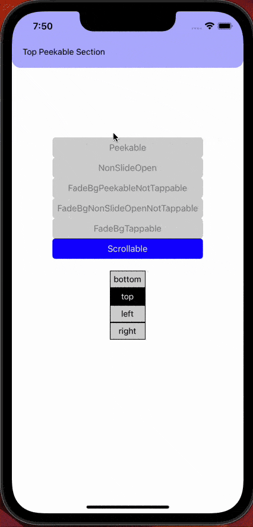
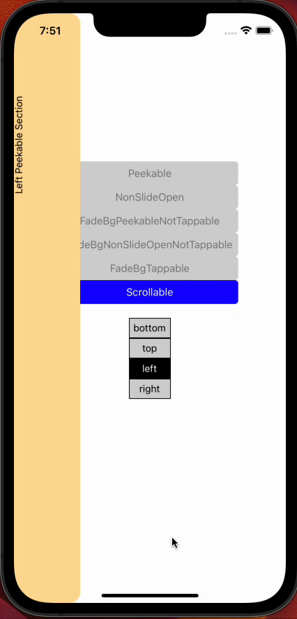
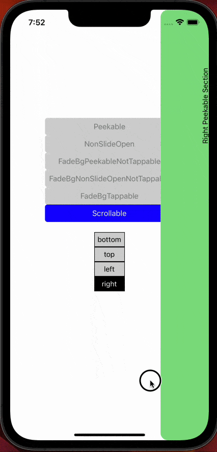

# Scrollable

[Source code](../../example/src/Scrollable)

These demos show the effect of including scrolling view inside sliding drawer.

## Vertical Scrolling

Vertical scrolling is always possible in a horizontal sliding drawer, because the scrolling direction is opposite to the sliding event captured by the sliding drawer. However, directly including vertical scrolling in a vertical sliding drawer will not work, because the scrolling direction is the same as the sliding event, which means any attempt to vertically scroll a vew will be captured by the sliding drawer first and hence ignored by the scrolling view underneath.

To achieve vertical scrolling inside a vertical sliding drawer, we must include `nonSlideableYRanges` to tell the sliding drawer within which y-coord ranges the sliding event shall be ignored. Whatever sliding event ignored by the sliding drawer will be picked up by the views underneath. Therefore, if we place the scrolling view right inside `nonSlideableYRanges`, vertical scrolling is possible.

In implementation, we have to first obtain the y-range of the scrolling view and then supply it to `nonSlideableYRanges`. Due to the fact that the sliding drawer animation is implemented via reference (i.e. it does NOT re-render upon state change), it is not possible to dynamically supply `nonSlideableYRanges` after the sliding drawer has already been rendered. Thus, we need to use a double-rendering trick to obtain the y-range of the scrolling view in a dummy sliding drawer and then render the real one. For details, check the source code for [bottom drawer](../../example/src/Scrollable/Drawers/BottomDrawer.tsx) and [top drawer](../../example/src/Scrollable/Drawers/TopDrawer.tsx)

It is possible to include multiple scrolling view in a sliding drawer, as is shown in the demo.

<table>
  <tr>
    <td>  </td>
    <td>  </td>
  </tr>
</table>

## Horizontal Scrolling

Similar to vertical scrolling, Horizontal scrolling is always possible in a vertical sliding drawer, but not possible navively in a horizontal drawer. To implement horizontal scrolling in a horizontal sliding drawer, we must supply `nonSlideableXRanges`, which tells the sliding drawer wihtin which x-coord ranges the sliding event shall be ignored, and hence picked up by a scrolling view underneath. The implementation method is the same as vertical scrolling.

One interesting thing to note in the demo below is that by supplying both `nonSlideableXRanges` and `nonSlideableYRanges`, we are able to restrict the non-slideable area to just the scrolling view itself, while leaving all the other parts of the sliding drawer perfectly slideable. For details of this implementation, check the source code for [left drawer](../../example/src/Scrollable/Drawers/LeftDrawer.tsx) and [right drawer](../../example/src/Scrollable/Drawers/RightDrawer.tsx)

<table>
  <tr>
    <td>  </td>
    <td>  </td>
  </tr>
</table>